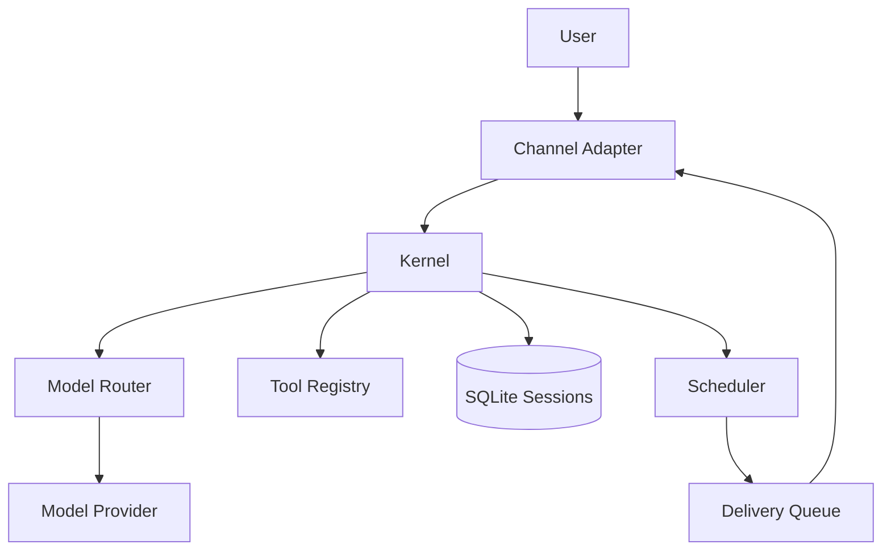

# PicoBot Architecture

PicoBot is a security-first agent platform that routes every tool call through a single enforcement layer. The system is designed to keep tool execution safe, auditable, and channel-agnostic while supporting multiple model providers and a TUI-first experience.

## High-Level Components

### Kernel
The Kernel is the core enforcement point. It validates tool input schemas, computes required permissions, checks capability grants, and invokes tools. It also wraps tool output as untrusted data before returning it to the model.

### Tools
Tools are modular units with JSON schemas and explicit permission requirements. They never self-authorize. Examples include:
- Filesystem (scoped read/write via glob paths)
- Shell (explicit command allowlist)
- HTTP fetch (domain allowlist)
- Memory (user/session scoped)
- Scheduler (create/list/cancel jobs)

### Models and Routing
Model adapters are built on top of the `genai` client. The router selects the configured model by ID and dispatches requests to the correct provider. Streaming responses are normalized into model events (tokens + tool calls).

### Channels
Channels normalize inbound and outbound messaging across interfaces:
- TUI (Ratatui)
- API + WebSocket
- WhatsApp (native `whatsapp-rust` client)

Each channel has a permission profile that limits capabilities and optionally disables interactive prompts.

### Sessions and Memory
Sessions store conversation history, permissions, and state in SQLite. Memory is user-scoped and can be injected as system context. Summaries can be generated to manage context size.

### Scheduler and Heartbeats
The scheduler manages delayed or recurring jobs with per-user quotas, leases, and backoff. Heartbeats register scheduled prompts on startup.

### Notifications and Delivery
Outbound delivery is queued and retried with backoff. This decouples model responses from the transport layer (e.g., WhatsApp).

## Request Flow

1. An inbound message is normalized by a channel adapter.
2. The session is loaded and merged into the ConversationState.
3. The model generates text or tool calls.
4. Tool calls are validated and permission-checked by the Kernel.
5. Tool output is wrapped as untrusted data and re-fed to the model.
6. The final assistant response is delivered to the user.

## Security Invariants

- All tool input is schema-validated before execution.
- Capability checks are allowlist-based and enforced in the Kernel.
- Tool output is wrapped as untrusted data to reduce prompt injection risk.
- Filesystem paths are normalized before permission checks.

## Storage

- `conversations.db` stores sessions, messages, summaries, and memory.
- `whatsapp.db` stores WhatsApp session credentials and state.

## Diagram

